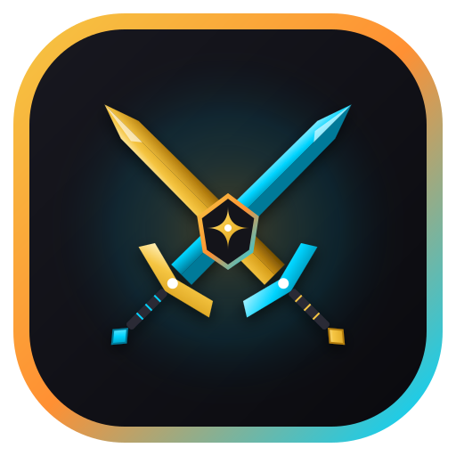

<div align="center">
  

  # Skillungo
  **Gamified Learning & Real-Time 1v1 Battle Platform for Indonesian Vocational & High School Students**

[](package.json)
[](https://nextjs.org/)
[](https://react.dev/)
[](https://www.typescriptlang.org/)
[](https://tailwindcss.com/)
[](https://supabase.com/)
[](https://github.com/pmndrs/zustand)

</div>

<br />

**Skillungo** adalah platform pembelajaran berbasis web mutakhir yang merevolusi cara belajar siswa SMK dan SMA di Indonesia. Dengan memadukan kurikulum digital interaktif, mekanik role-playing game (RPG), dan arena pertarungan kuis duel 1v1 secara *real-time*, Skillungo mentransformasi proses belajar yang monoton menjadi petualangan kompetitif yang seru, terukur, dan memotivasi.

Siswa dapat memilih kelas karakter avatar RPG, menaklukkan modul pembelajaran berbasis bab, menyelesaikan daily quest, bertanding langsung dengan teman secara sinkronus atau melawan AI Sentinel, mengumpulkan XP untuk naik level, hingga menukarkan poin hadiah di Store Voucher.

---

## Table of Contents

- [Key Features](#-key-features)
- [Architecture & Technology Stack](#-architecture--technology-stack)
- [System Requirements](#-system-requirements)
- [Local Installation & Setup](#-local-installation--setup)
- [Project Directory Structure](#-project-directory-structure)
- [Database & Schema Architecture](#-database--schema-architecture)
- [Security Hardening & Privacy](#-security-hardening--privacy)
- [Deployment Guide](#-deployment-guide)
- [Contributing](#-contributing)

---

## Key Features

- **Interactive Micro-Learning Modules (`/modules`):** Modul materi digital terstruktur (Coding, Desain UI/UX, Produktivitas, dan Bisnis) dengan sistem bab interaktif, video embedding, pelacak progres membaca persentase, dan kuis pemahaman di akhir tiap bab berhadiah XP.
- **Real-Time 1v1 Quiz Battle Arena (`/battle`):** Arena duel kuis real-time berbasis WebSockets Supabase Realtime Channels. Fitur lengkap mencakup:
  - *Buat Room*: Bikin arena tanding kustom dengan pilihan kategori materi dan kode unik 6 karakter.
  - *Join Room*: Masuk langsung ke ruang tunggu tanding rekan dengan input kode room.
  - *Matchmaking Otomatis*: Sistem pencarian lawan publik secara otomatis dan seimbang.
  - *Vs Computer (AI Bot)*: Mode latihan mandiri instan melawan bot cerdas tanpa harus menunggu pemain lain online (`/battle/computer`).
- **RPG Character Progression & Roles:** Pilihan 4 kelas karakter khas RPG (*Warrior*, *Mage*, *Archer*, *Healer*) dengan atribut pasif combat, animasi visual, kalkulasi XP dinamis, level-up threshold, dan lencana title prestasi.
- **Dynamic Combat Mechanics & Visual Feedback:** Sistem health point (HP), floating combat damage numbers, status hit multiplier (Combo Streak), efek visual attack/defend, dan rekapitulasi poin akhir.
- **Gamified Daily Quests & Streaks:** Misi harian otomatis (*Login Harian*, *Selesaikan Modul*, *Menangkan Battle 1v1*) dengan indikator streak harian untuk menjaga retensi dan kedisiplinan belajar.
- **National & School Leaderboards (`/leaderboard`):** Papan peringkat dinamis yang memetakan siswa berprestasi berdasarkan perolehan XP all-time, mingguan, serta akumulasi peringkat sekolah dan kota asal.
- **Voucher & Reward Store (`/voucher`):** Konversikan hasil kerja keras belajar dan perolehan XP ke dalam koin untuk ditukarkan dengan voucer diskon kursus, sertifikat, aset digital, atau merchandise.
- **Ultra-Fast Single-Page Experience (SPA Architecture):** Transisi halaman instan 0ms antar dashboard, modul, dan leaderboard menggunakan arsitektur caching memori Zustand (*stale-while-revalidate*) dan prefetching rute Next.js.
- **Sleek Cyber-Dark Aesthetic:** Antarmuka responsif bernuansa gelap elegan dengan palet warna terkurasi, glassmorphism card, mikro-animasi Framer Motion, dan tipografi modern.

---

## Architecture & Technology Stack

Platform Skillungo dibangun di atas fondasi teknologi modern berorientasi performa tinggi dan skalabilitas:

- **Framework & Core:** [Next.js 16](https://nextjs.org/) (App Router, React Server & Client Components) + [React 19](https://react.dev/).
- **Type Safety:** [TypeScript 5](https://www.typescriptlang.org/) dengan kontrak antarmuka end-to-end yang ketat.
- **Styling & Tokens:** [Tailwind CSS v4](https://tailwindcss.com/) dipadukan dengan arsitektur CSS Variables modern (`app/globals.css`) untuk konsistensi tema gelap yang mendalam.
- **State Management & Caching:** [Zustand 5](https://github.com/pmndrs/zustand) untuk central data cache (`userStore`, `contentStore`, `battleStore`) demi navigasi instan tanpa overhead re-fetching.
- **Real-Time Synchronization:** [Supabase Realtime](https://supabase.com/docs/guides/realtime) (WebSockets & PostgreSQL changes) untuk sinkronisasi state battle, status ready, timer sinkron, dan submisi jawaban antar kedua pemain.
- **Database & Auth:** [Supabase](https://supabase.com/) (PostgreSQL 15, Supabase Auth via SSR cookie handling, dan Row Level Security).
- **Physics & Micro-Animations:** [Framer Motion v12](https://motion.dev/) untuk transisi kartu modul, damage number RPG terapung, dan interaksi layout responsif.
- **Iconography:** [Lucide React](https://lucide.dev/) untuk ikon SVG skalabel dan berkinerja tinggi.

---

## System Requirements

Sebelum menjalankan aplikasi secara lokal, pastikan lingkungan pengembangan Anda memenuhi spesifikasi berikut:

- [Node.js](https://nodejs.org/) v18.18.0 atau versi yang lebih baru (rekomendasi LTS v20+)
- npm v9+ (atau pnpm / yarn)
- Akun dan project [Supabase](https://supabase.com/) (Tier gratis sudah sangat mencukupi)

---

## Local Installation & Setup

### 1. Clone Repository

```bash
git clone https://github.com/haidirwf/vs-tebak.git skillungo
cd skillungo
```

### 2. Install Dependencies

```bash
npm install
```

### 3. Konfigurasi Environment Variables

Buat file `.env.local` di root direktori project:

```bash
cp .env.example .env.local
```

Isi variabel lingkungan dengan kredensial Supabase Anda:

```env
# Supabase Public Configuration
NEXT_PUBLIC_SUPABASE_URL=https://your-project-id.supabase.co
NEXT_PUBLIC_SUPABASE_ANON_KEY=your-supabase-anon-key

# Optional (Khusus cronjob pembersihan battle basi)
BATTLE_CLEANUP_SECRET=your-cleanup-secret
```

### 4. Setup Database & Seeding (Supabase)

1. Masuk ke dashboard project Supabase Anda di [supabase.com](https://supabase.com).
2. Buka menu **SQL Editor** -> **New query**.
3. Buka file [`supabase/schema_new_complete.sql`](supabase/schema_new_complete.sql), salin seluruh isinya, dan klik **Run**.
4. Skrip tersebut akan otomatis membangun:
   - Tabel `profiles`, `modules`, `user_modules`, `battle_rooms`, `battle_questions`, `daily_quests`, `user_daily_quests`, `vouchers`, dan `user_vouchers`.
   - Mengaktifkan Row Level Security (RLS) serta fungsi database PostgreSQL (seperti trigger sinkronisasi profil user dari `auth.users`).
   - Melakukan seeding data awal modul pembelajaran dan bank soal kuis battle.

### 5. Jalankan Development Server

```bash
npm run dev
```

Buka peramban web Anda dan akses:
```text
http://localhost:3000
```
*(atau port yang ditampilkan pada terminal Anda, misal `http://localhost:5173`)*

### 6. Build untuk Produksi

Untuk memverifikasi kesiapan bundle rilis dan type safety:

```bash
npm run build
npm run start
```

---

## Project Directory Structure

```text
skillungo/
├── app/
│   ├── (auth)/                       # Rute otentikasi
│   │   ├── login/page.tsx            # Halaman masuk siswa
│   │   └── register/page.tsx         # Halaman pendaftaran siswa & pemilihan kelas
│   ├── (dashboard)/                  # Rute berotentikasi & dashboard shell
│   │   ├── battle/                   # Arena duel kuis 1v1
│   │   │   ├── [roomId]/             # Ruang tanding real-time (BattleArena.tsx)
│   │   │   ├── computer/             # Mode latihan vs AI Sentinel (PracticeArena.tsx)
│   │   │   └── page.tsx              # Hub aksi battle & daftar room publik
│   │   ├── dashboard/page.tsx        # Ringkasan progres, daily quests, & modul aktif
│   │   ├── leaderboard/page.tsx      # Papan peringkat nasional & antar sekolah
│   │   ├── modules/                  # Eksplorasi modul pembelajaran
│   │   │   ├── [slug]/page.tsx       # Pembaca materi bab & kuis evaluasi
│   │   │   └── page.tsx              # Katalog modul per kategori
│   │   ├── profile/page.tsx          # Profil pengguna, statistik RPG, & pengaturan
│   │   ├── voucher/page.tsx          # Toko penukaran hadiah & riwayat kupon
│   │   └── layout.tsx                # Dashboard navigation shell & sidebar wrapper
│   ├── api/                          # Next.js Route Handlers
│   │   ├── auth/                     # Endpoint helper autentikasi & sesi
│   │   └── battle/                   # Endpoint aksi battle & pembersihan room
│   ├── favicon.ico                   # App favicon
│   ├── globals.css                   # Core design tokens, theme variables, & reset
│   ├── layout.tsx                    # Root layout & font provider
│   └── page.tsx                      # Landing page publik & showcase platform
├── components/
│   ├── character/                    # Komponen visual avatar & role class RPG
│   ├── dashboard/                    # Widget dashboard statistik, hero, & quest
│   ├── landing/                      # Section showcase landing page
│   ├── layout/                       # Sidebar navigasi, Header, & Mobile drawer
│   ├── onboarding/                   # Dialog pemandu pengguna baru
│   ├── quest/                        # Kartu pelacak progress daily quest
│   └── ui/                           # Primitif UI (Button, Card, Input, Progress, Modal)
├── lib/
│   ├── auth/                         # Utilitas validasi autentikasi pengguna
│   ├── game/                         # Rumus kalkulasi XP, level RPG, & combat mechanics
│   ├── server/                       # Helper query server-side
│   ├── supabase/                     # Supabase client singleton (browser, server, middleware)
│   └── utils.ts                      # Formatters mata uang, kelas utilitas, dan tanggal
├── stores/                           # Central Zustand client state & cache
│   ├── battleStore.ts                # State battle realtime & skor ronde
│   ├── contentStore.ts               # In-memory cache modul, quest, & leaderboard
│   └── userStore.ts                  # State profil aktif, level, & XP pengguna
├── supabase/
│   ├── migrations/                   # Riwayat migrasi skema SQL terpisah
│   ├── demo_boost_account.sql        # Skrip opsional demo akun penguji
│   └── schema_new_complete.sql       # Konsolidasi skema database & seed lengkap
├── types/                            # Definisi TypeScript untuk skema data platform
├── next.config.ts                    # Konfigurasi bundler Next.js & memory buffer
├── package.json                      # Daftar dependensi & script runner
└── tsconfig.json                     # Konfigurasi compiler TypeScript
```

---

## Database & Schema Architecture

Database Skillungo dirancang secara terisolasi dan modular di PostgreSQL Supabase:

- **`profiles`**: Menyimpan data identitas siswa, kelas avatar RPG (`warrior`, `mage`, `archer`, `healer`), perolehan total XP, level berjalan, streak harian, dan metadata sekolah.
- **`modules` & `user_modules`**: Menyimpan silabus bab modul dalam format JSONB terstruktur, batas durasi, XP reward, dan progres pengerjaan masing-masing siswa (`not_started`, `in_progress`, `completed`).
- **`battle_rooms` & `battle_questions`**: Mengelola status perputaran room battle (`waiting`, `lobby`, `playing`, `finished`), relasi ID pemain 1 & 2, penampung jawaban, skor, dan pool soal kuis.
- **`daily_quests` & `user_daily_quests`**: Template quest harian otomatis dan pelacak progres pemenuhan target misi per tanggal aktif.
- **`vouchers` & `user_vouchers`**: Katalog voucher reward dan buku kas penukaran kode kupon siswa.

---

## Security Hardening & Privacy

Platform mengedepankan keamanan data siswa dan integritas permainan:

- **Strict Row Level Security (RLS):** Seluruh tabel database PostgreSQL dilindungi oleh kebijakan RLS. Siswa hanya diizinkan membaca data miliknya dan dilarang memanipulasi skor atau data siswa lain.
- **Perlindungan Data Pribadi Pengguna:** File migrasi lokal, data ekspor riwayat (`*.csv`), file skrip generator, serta file lingkungan rahasia (`.env*`) dieksklusikan secara ketat oleh `.gitignore` sehingga tidak pernah terlacak ke publik repository.
- **Safe Authentication Cookies:** Menggunakan `@supabase/ssr` untuk menangani token JWT autentikasi dengan rotasi otomatis dan mitigasi serangan CSRF/XSS.
- **Database Idempotency & Clean Teardown:** Skrip pembuat skema menggunakan klausul aman (`IF NOT EXISTS`, `CASCADE`) serta trigger pembersihan room battle basi untuk mencegah kebocoran memori pada database realtime.

---

## Deployment Guide

### Deploy ke Vercel (Rekomendasi)

1. Hubungkan repository GitHub Anda ke [Vercel](https://vercel.com).
2. Vercel akan otomatis mendeteksi framework **Next.js**.
3. Pada bagian **Environment Variables**, tambahkan:
   - `NEXT_PUBLIC_SUPABASE_URL`: URL project Supabase Anda.
   - `NEXT_PUBLIC_SUPABASE_ANON_KEY`: Kunci anon publik Supabase Anda.
   - *(Opsional)* `BATTLE_CLEANUP_SECRET`: Token rahasia endpoint pembersihan room.
4. Klik tombol **Deploy**. Aplikasi akan terkompilasi dan siap digunakan secara global dalam hitungan detik.

---

## Contributing

Kontribusi dan saran pengembangan selalu disambut baik! Untuk berkontribusi:

1. Lakukan **Fork** pada repository ini.
2. Buat branch fitur baru Anda: `git checkout -b feature/fitur-keren`.
3. Commit perubahan Anda dengan format [Conventional Commits](https://www.conventionalcommits.org/):
   ```bash
   git commit -m 'feat: tambahkan animasi kemenangan battle baru'
   ```
4. Push ke branch Anda: `git push origin feature/fitur-keren`.
5. Buat sebuah **Pull Request** baru.
