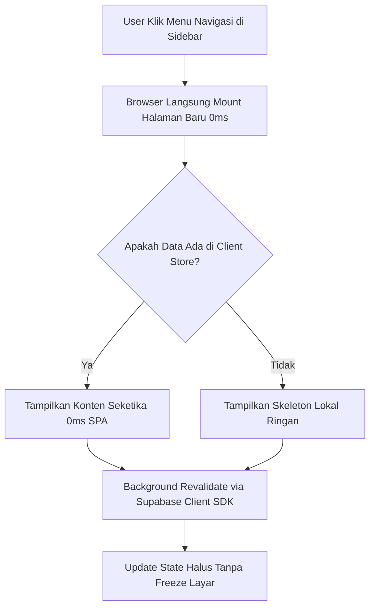

# Walkthrough: Mengatasi Beratnya Berpindah Halaman (Migrasi ke SPA Experience)

Dokumen ini berisi panduan teknis langkah demi langkah untuk menghilangkan jeda waktu (latency) dan sensasi berat saat berpindah halaman pada Skillungo, mengubah perilaku aplikasi menjadi **instan layaknya Single-Page Application (SPA) murni**.

---

## 1. Analisis Akar Masalah (Root Cause)

Meskipun Skillungo sudah menggunakan Next.js App Router dengan navigasi `<Link>`, aplikasi terasa berat seperti MPA tradisional karena:

1. **Server-Side Blocking pada Setiap Navigasi**:
   - Halaman utama ([dashboard/page.tsx](file:///home/idal/sekolajh/vs-tebak/app/(dashboard)/dashboard/page.tsx), [modules/page.tsx](file:///home/idal/sekolajh/vs-tebak/app/(dashboard)/modules/page.tsx), [leaderboard/page.tsx](file:///home/idal/sekolajh/vs-tebak/app/(dashboard)/leaderboard/page.tsx)) adalah *async Server Components* (RSC).
   - Setiap kali menu diklik, browser harus menunggu server Node.js Next.js melakukan round-trip jaringan ke database Supabase Cloud (menjalankan 3–5 query SQL sekaligus).
   - Hasilnya ada jeda 500ms – 1.500ms sebelum komponen halaman baru bisa dikirim ke browser.

2. **Flickering Skeleton `loading.tsx`**:
   - Adanya `loading.tsx` di tingkat root dashboard memicu skeleton loading setiap kali navigasi antar menu menunggu respons server, memberikan efek layar berkedip.

3. **Buffer Memori Agresif Dibuang**:
   - Pada [next.config.ts](file:///home/idal/sekolajh/vs-tebak/next.config.ts), konfigurasi `pagesBufferLength: 2` dan `maxInactiveAge: 60s` memaksa browser membuang halaman yang baru dikunjungi dari memori, sehingga saat user kembali ke dashboard, seluruh proses render server diulang dari awal.

4. **Eksekusi Logika Berulang di [layout.tsx](file:///home/idal/sekolajh/vs-tebak/app/(dashboard)/layout.tsx)**:
   - Server menjalankan `ensureDailyQuestsAndProgress` dan mengambil `profiles` di sisi server pada request rute dashboard.

---

## 2. Arsitektur Target: Client-Side SPA Navigation



---

## 3. Langkah Demi Langkah Implementasi

### Langkah 1: Optimalisasi Navigasi Link & Prefetch
Di file [components/layout/Sidebar.tsx](file:///home/idal/sekolajh/vs-tebak/components/layout/Sidebar.tsx):
- Tambahkan properti `prefetch={true}` pada semua komponen `<Link>` navigasi agar Next.js memuat kode halaman begitu link terlihat/hover.

```tsx
<Link
    key={item.href}
    href={item.href}
    prefetch={true}
    ...
>
```

---

### Langkah 2: Buat Central Data Cache di Zustand
Gunakan Zustand yang sudah tersedia di [stores/](file:///home/idal/sekolajh/vs-tebak/stores) untuk menyimpan data modul, quests, dan leaderboard di memori browser.

Buat file baru, misalnya `stores/contentStore.ts`:
- Menyimpan cache:
  - `modules`: list modul & status pengerjaan user.
  - `quests`: list daily quests & user daily quest.
  - `leaderboard`: data all-time, weekly, & school rankings.
  - `lastFetched`: timestamp untuk mencegah re-fetch berlebihan dalam rentang waktu singkat (misal 1–2 menit).

---

### Langkah 3: Konversi Halaman Dashboard Menjadi Client-Side Fetching
Ubah [app/(dashboard)/dashboard/page.tsx](file:///home/idal/sekolajh/vs-tebak/app/(dashboard)/dashboard/page.tsx) menjadi `'use client'`:
1. Navigasi ke `/dashboard` terjadi secara **0ms (instan)**.
2. Komponen membaca data user dari `useUserStore()` dan `contentStore`.
3. Jika data belum tersedia, tampilkan skeleton ringan di dalam container konten (bukan membekukan navigasi seluruh layar).
4. Ambil data langsung dari browser menggunakan `createClient()` dari `@/lib/supabase/client`.

---

### Langkah 4: Konversi Halaman Modul & Leaderboard
Ubah [app/(dashboard)/modules/page.tsx](file:///home/idal/sekolajh/vs-tebak/app/(dashboard)/modules/page.tsx) dan [app/(dashboard)/leaderboard/page.tsx](file:///home/idal/sekolajh/vs-tebak/app/(dashboard)/leaderboard/page.tsx):
1. Pindahkan logic data fetching ke sisi browser (Client Component).
2. Membaca dari client store terlebih dahulu (*stale-while-revalidate*).
3. Saat berpindah bolak-balik antara Modul, Leaderboard, dan Dashboard, halaman **langsung terbuka tanpa loading lagi**.

---

### Langkah 5: Sesuaikan Buffer Memory di [next.config.ts](file:///home/idal/sekolajh/vs-tebak/next.config.ts)
Perlonggar buffer halaman agar Next.js tidak terlalu cepat membuang halaman dari RAM:

```typescript
const nextConfig: NextConfig = {
  poweredByHeader: false,
  compress: true,
  experimental: {
    optimizePackageImports: ['lucide-react'],
  },
  onDemandEntries: {
    maxInactiveAge: 300 * 1000, // 5 menit
    pagesBufferLength: 10,       // Simpan sampai 10 halaman di buffer
  },
};
```

---

### Langkah 6: Hilangkan Flash Skeleton `loading.tsx` Global
Ubah atau pisahkan [app/(dashboard)/loading.tsx](file:///home/idal/sekolajh/vs-tebak/app/(dashboard)/loading.tsx) agar tidak memicu skeleton layout penuh di setiap transisi menu, melainkan cukup indikator progress bar tipis di bagian atas atau skeleton spesifik per halaman jika cache kosong.

---

## 4. Evaluasi & Hasil yang Diharapkan

| Metrik | Sebelum Optimasi | Sesudah Optimasi (SPA Architecture) |
| :--- | :--- | :--- |
| **Delay Pindah Halaman** | 500ms – 1.500ms | **0ms – 50ms (Instan)** |
| **Beban Server Next.js** | Query SQL berulang tiap klik | Database di-query via client & di-cache |
| **UX Transisi** | Layar berkedip (*flash skeleton*) | Seamless, layout tetap tenang dan responsif |
| **Retensi Data Navigasi** | Sering reset/reload | Tersimpan di memori browser |

---

## 5. Rencana Tahap Eksekusi

1. **Fase 1**: Penyesuaian `next.config.ts` dan aktivasi `prefetch` di `Sidebar.tsx`.
2. **Fase 2**: Pembuatan `contentStore.ts` untuk caching data di sisi client.
3. **Fase 3**: Konversi `dashboard/page.tsx` & `modules/page.tsx` ke client component dengan stale-while-revalidate.
4. **Fase 4**: Konversi `leaderboard/page.tsx` & `voucher/page.tsx`.
5. **Fase 5**: Verifikasi pengalaman navigasi langsung di browser.
